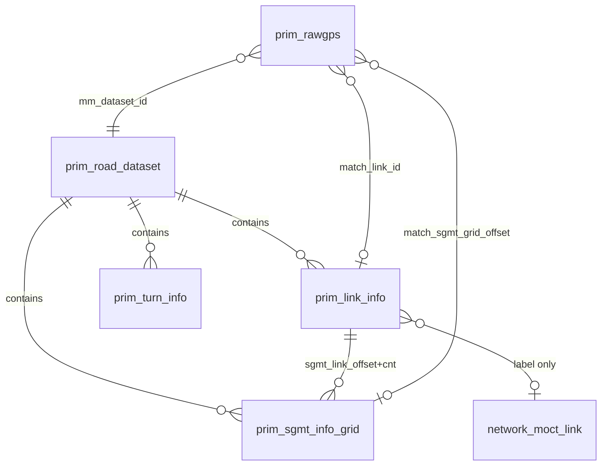

# PRIM_ 맵매칭 지도 표시 DB 설계안

`SGMT_INFO_GRID` · `LINK_INFO` 구조를 기준으로, **맵매칭 완료 후 지도에 오차 없이 결과를 표시**하기 위한 PostgreSQL/PostGIS 설계입니다.

- 테이블명: **`prim_` 접두사** (`roadnet` 스키마)
- 좌표: **WGS84** (PSF와 동일, `Degree × 360000` 정수 + 경위도 `numeric` 병행)
- 원본: **`link.psf`** (권장) 또는 `CreateData/data` Shapefile → PSF 동일 파이프라인
- 기존 `network.moct_*` / `multilink` / `turn_info`: **형상·매칭 권위에는 미사용**, 라벨·업무 속성 보강용 **선택 조인**

---

## 1. 결론 — 어느 테이블이 지도 표시에 적합한가?

| 테이블 | 지도 표시 적합도 | 역할 |
|--------|------------------|------|
| **`prim_link_info`** (슬림) | ★★★ **필수 (1순위)** | `geom` + `len` + `match_offset_m` → **M 점·링크 강조** |
| **`prim_sgmt_info_grid`** | ★★☆ **선택** | 세그먼트 단위 검증·디버깅 (표시만이면 생략 가능) |

### 한 줄 답

> **지도에 M을 표출할 때는 슬림 `prim_link_info`(`link_id`, `len`, `geom` + `match_offset_m`)가 가장 적합**합니다.  
> `sgmt_link_offset`, `sgmt_link_cnt`, `turn_offset`, `turn_cnt`, `dataset_id`는 **지도 표시용 테이블에 없어도 됩니다.**

---

## 2. 테이블별 장·단점

### 2.1 `prim_sgmt_info_grid` (SGMT_INFO_GRID)

| 장점 | 단점 |
|------|------|
| PSF `GRID_SGMT_INFO`/`LINK_SGMT_INFO`와 **1:1** — 오차 최소 | 링크 전체 도로명·제한속도 등 **속성 없음** |
| `X,Y` + `ANG_DIR` + `LEN_SGMT`로 **직선 세그먼트 완전 재현** | 지도에 링크 **전 구간**을 한 번에 그리려면 **N개 세그먼트 결합** 필요 |
| `LEN_FROM_LINK`로 링크 내 위치·**매칭 offset** 계산 직결 | GRID 중복 저장(동일 세그먼트가 여러 GRID에 등장) — **링크 단위 조회 시 `link_id` 인덱스** 필요 |
| `SGMT_GRID_OFFSET`으로 PSF 전역 오프셋 **추적·검증** 가능 | |

**지도 표시 용도:** 매칭점 M, 세그먼트 하이라이트, `intersect_len` 시각 검증

### 2.2 `prim_link_info` (LINK_INFO)

| 장점 | 단점 |
|------|------|
| `SGMT_LINK_OFFSET` + `SGMT_LINK_CNT`로 링크 소속 세그먼트 **범위 조회** | **세그먼트 좌표 없음** — 단독으로 M 좌표 불가 |
| `LEN`, `NAME`, `ROAD_TYPE` 등 **도로 라벨·팝업** | Polyline geom 없음(별도 생성 또는 세그먼트 결합) |
| `ST_ND_*` / `ED_ND_*`로 노드·방향 **f_node 기준 offset** 정의 | |
| `TURN_OFFSET`/`TURN_CNT`로 연속 맵매칭 경로 **디버깅** | |

**지도 표시 용도:** 매칭된 링크 전체 강조, 팝업(도로명·등급), `match_offset_m` 분모(`LEN`)

### 2.3 보완 관계

```
prim_link_info (링크 메타 + 세그먼트 범위)
       │
       │  SGMT_LINK_OFFSET .. +SGMT_LINK_CNT
       ▼
prim_sgmt_info_grid (세그먼트 형상)  ← 맵매칭 교차점 위치
       │
       ▼
prim_rawgps.match_* (매칭 결과)
```

선택 보완:

| 보완 | 방법 |
|------|------|
| 링크 한 줄로 빠르게 그리기 | `prim_link_info.geom` = 소속 세그먼트 `ST_MakeLine` **적재 시 생성** |
| MOCT 도로번호·multilink | `network.moct_link` / `multilink` **LEFT JOIN** (표시 라벨만) |
| 회전 제한 디버깅 | `prim_turn_info` 또는 `network.turn_info` |
| PSF 세대 관리 | `prim_road_dataset` |

---

## 3. PSF 필드 매핑

### 3.1 `prim_sgmt_info_grid` ↔ PSF

| 설계 컬럼 | PSF (`GRID_SGMT_INFO` / `LINK_SGMT_INFO`) | 비고 |
|-----------|-------------------------------------------|------|
| `sgmt_grid_offset` | `dwSgmtOffset` | 전역 0~n, **PK 후보** |
| `x_360000` | `dwX` | 경도 × 360000 |
| `y_360000` | `dwY` | 위도 × 360000 |
| `start_lon` | `dwX / 360000` | WGS84 경도 |
| `start_lat` | `dwY / 360000` | WGS84 위도 |
| `ang_dir` | `wDirAng` | 방위각(°) |
| `len_sgmt` | `wLenSgmt` | **세그먼트 길이(m)** ※ PSF 코드 기준 |
| `link_id` | `qwLinkID` | |
| `len_from_link` | `wLenFromLink` | 링크 시작→세그먼트 시작(m) |

※ 명세의 `LEN_SGMT (0.01sec)` 표기는 레거시 문서 표현일 수 있으며, 현행 `link.psf`/`GISUtil`에서는 **미터(m) `uint16`** 로 처리합니다.

### 3.2 `prim_link_info` ↔ PSF `LINK_INFO`

| 설계 컬럼 | PSF | 비고 |
|-----------|-----|------|
| `link_id` | `qwLinkID` (LINK_INFO_DATA) | |
| `sgmt_link_offset` | `dwSgmtOffset` | 링크 첫 세그먼트 `sgmt_grid_offset` |
| `sgmt_link_cnt` | `wSgmtCount` | |
| `turn_offset` | `dwTurnOffset` | |
| `turn_cnt` | `nTurnCount` | |
| `speed_limit` | `nMaxSpeed` | |
| `len` | `dfLen` | 링크 길이(m) |
| `road_rank` | `nRoadRank` | |
| `road_connect` | `nConnect` | 0/1, 구코드 101~108 |
| `road_type` | `nRoadType` | 0 일반,1 교량,2 터널,3 고가,4 지하 |
| `lanes` | `nLanes` | |
| `name` | `szRoadName` | |
| `st_nd_id`, `st_nd_lon/lat` | `qwStNodeID`, `dwStNodeX/Y` | PSF 좌표 → `numeric` 경위도 |
| `st_nd_name`, `ed_nd_name` | — | PSF에 없음 → ETL 시 `network.moct_node.node_name` |
| `ed_nd_id`, `ed_nd_lon/lat` | `qwEdNodeID`, `dwEdNodeX/Y` | 동일 |

### 3.3 맵매칭 결과 저장 (서버 → `prim_rawgps`)

| 서버 | DB 컬럼 |
|------|---------|
| `qwLinkID` | `match_link_id` |
| `wLenFromLink` | (세그먼트 식별용) |
| `dfSgmtMatchLen` | 세그먼트 위 거리 |
| **`wLenFromLink + dfSgmtMatchLen`** | **`match_offset_m`** |
| 매칭 세그먼트 `dwSgmtOffset` | **`match_sgmt_grid_offset`** |
| `dfMatchX`, `dfMatchY` | `match_lon`, `match_lat` (호환) |

---

## 4. ER 관계



---

## 5. 테이블 정의

### 5.0 `prim_road_dataset` — PSF 세대

| 컬럼 | 타입 | NULL | PK/FK | 설명 |
|------|------|------|-------|------|
| `dataset_id` | `serial` | N | **PK** | PSF 적재 세대 |
| `psf_path` | `varchar(512)` | N | | |
| `psf_sha256` | `char(64)` | Y | | |
| `link_cnt` | `integer` | N | | = `prim_link_info` 건수 |
| `sgmt_cnt` | `integer` | N | | = `prim_sgmt_info_grid` 건수 |
| `is_active` | `boolean` | N | | 활성 1건 (`true`) |
| `created_at` | `timestamptz` | N | | |

```sql
CREATE TABLE roadnet.prim_road_dataset (
    dataset_id   serial PRIMARY KEY,
    psf_path     varchar(512) NOT NULL,
    psf_sha256   char(64),
    link_cnt     integer NOT NULL DEFAULT 0,
    sgmt_cnt     integer NOT NULL DEFAULT 0,
    is_active    boolean NOT NULL DEFAULT false,
    created_at   timestamptz NOT NULL DEFAULT now()
);

CREATE UNIQUE INDEX uq_prim_road_dataset_active
    ON roadnet.prim_road_dataset (is_active) WHERE is_active = true;
```

---

### 5.1 `prim_sgmt_info_grid` — 세그먼트 (지도 정밀 표시 핵심)

| 컬럼 | 타입 | NULL | PK/FK | 설명 |
|------|------|------|-------|------|
| `dataset_id` | `integer` | N | **PK**, FK | → `prim_road_dataset` |
| `sgmt_grid_offset` | `integer` | N | **PK** | PSF `SGMT_OFFSET` (0~) |
| `x_360000` | `integer` | N | | 시작 X (도×360000) |
| `y_360000` | `integer` | N | | 시작 Y (도×360000) |
| `start_lon` | `numeric(10,6)` | N | | WGS84 경도 |
| `start_lat` | `numeric(10,6)` | N | | WGS84 위도 |
| `ang_dir` | `smallint` | N | | 방위각(°) |
| `len_sgmt` | `numeric(8,2)` | N | | 세그먼트 길이(m) |
| `link_id` | `varchar(10)` | N | FK 논리 | 링크 ID |
| `len_from_link` | `numeric(10,2)` | N | | 링크 시작→세그먼트 시작(m) |
| `end_lon` | `numeric(10,6)` | N | | 세그먼트 끝 경도 (적재 시 계산) |
| `end_lat` | `numeric(10,6)` | N | | 세그먼트 끝 위도 |
| `geom` | `geometry(LineString,4326)` | N | GIST | 2점 직선 (지도용) |

```sql
CREATE TABLE roadnet.prim_sgmt_info_grid (
    dataset_id        integer        NOT NULL
        REFERENCES roadnet.prim_road_dataset(dataset_id) ON DELETE CASCADE,
    sgmt_grid_offset  integer        NOT NULL,
    x_360000          integer        NOT NULL,
    y_360000          integer        NOT NULL,
    start_lon         numeric(10,6)  NOT NULL,
    start_lat         numeric(10,6)  NOT NULL,
    ang_dir           smallint       NOT NULL,
    len_sgmt          numeric(8,2)   NOT NULL,
    link_id           varchar(10)    NOT NULL,
    len_from_link     numeric(10,2)  NOT NULL DEFAULT 0,
    end_lon           numeric(10,6)  NOT NULL,
    end_lat           numeric(10,6)  NOT NULL,
    geom              geometry(LineString, 4326) NOT NULL,
    CONSTRAINT pk_prim_sgmt_info_grid
        PRIMARY KEY (dataset_id, sgmt_grid_offset),
    CONSTRAINT ck_prim_sgmt_len CHECK (len_sgmt > 0)
);

COMMENT ON TABLE  roadnet.prim_sgmt_info_grid IS 'PSF 세그먼트 — 맵매칭 교차점이 놓이는 직선 (SGMT_INFO_GRID)';
COMMENT ON COLUMN roadnet.prim_sgmt_info_grid.sgmt_grid_offset IS 'PSF 전역 SGMT_OFFSET (0~)';
COMMENT ON COLUMN roadnet.prim_sgmt_info_grid.len_from_link IS 'match_offset_m가 속한 세그먼트 탐색 키';
```

**INDEX**

```sql
CREATE INDEX idx_prim_sgmt_link
    ON roadnet.prim_sgmt_info_grid (dataset_id, link_id);

CREATE INDEX idx_prim_sgmt_link_len
    ON roadnet.prim_sgmt_info_grid (dataset_id, link_id, len_from_link);

CREATE INDEX idx_prim_sgmt_geom
    ON roadnet.prim_sgmt_info_grid USING GIST (geom);
```

---

### 5.2 `prim_link_info` — 링크 (지도 표시 **권장·슬림**)

맵매칭 좌표를 지도에 표출하는 용도라면 **PSF `LINK_INFO` 전량 미러가 아니라**, 아래 **슬림 구조**가 적합합니다.

#### 5.2.1 제외 가능 필드 (지도 표시 기준)

| 필드 | PSF 대응 | 지도 표출 시 | 이유 |
|------|----------|--------------|------|
| `dataset_id` | — | **생략 가능** | 활성 PSF 1세대만 유지·전량 `TRUNCATE` 재적재 시 `link_id` 단독 PK |
| `sgmt_link_offset` | `dwSgmtOffset` | **불필요** | `geom` 적재 완료 후 런타임 미사용 (ETL 내부만) |
| `sgmt_link_cnt` | `wSgmtCount` | **불필요** | 동일 |
| `turn_offset` | `dwTurnOffset` | **불필요** | 연속 맵매칭은 서버 `link.psf` 메모리 사용, 지도 표시 무관 |
| `turn_cnt` | `nTurnCount` | **불필요** | 동일 |

> `dataset_id`는 **PSF 버전을 DB에 여러 세대 보관**하거나, 과거 trip 매칭 결과를 **구형상과 함께** 조회할 때만 필요합니다.  
> 운영을 “항상 active 1세대 + 재적재”로 단순화하면 **`prim_road_dataset`만 두고 `prim_link_info` PK는 `link_id` 단독**으로 충분합니다.

#### 5.2.2 슬림 컬럼 (권장)

| 컬럼 | 타입 | NULL | PK | 설명 |
|------|------|------|-----|------|
| `link_id` | `varchar(10)` | N | **PK** | 링크 ID |
| `len` | `numeric(12,3)` | N | | 링크 길이(m) — `match_offset_m` 분모 |
| `geom` | `geometry(LineString,4326)` | N | GIST | PSF 세그먼트 결합선 (**표시 필수**) |
| `speed_limit` | `smallint` | Y | | 제한속도 |
| `road_rank` | `smallint` | Y | | 도로 등급 |
| `road_connect` | `smallint` | Y | | 연결로 |
| `road_type` | `smallint` | Y | | 시설 유형 (교량·터널·고가·지하) |
| `lanes` | `smallint` | Y | | 차로 |
| `name` | `varchar(46)` | Y | | 도로명 |
| `st_nd_id` | `varchar(10)` | Y | | 시작(출발) 노드 ID |
| `st_nd_name` | `varchar(50)` | Y | | 시작(출발) 노드명 — ETL 시 `network.moct_node.node_name` |
| `st_nd_lon` | `numeric(10,6)` | Y | | 시작 노드 경도 |
| `st_nd_lat` | `numeric(10,6)` | Y | | 시작 노드 위도 |
| `ed_nd_id` | `varchar(10)` | Y | | 종료(도착) 노드 ID |
| `ed_nd_name` | `varchar(50)` | Y | | 종료(도착) 노드명 — ETL 시 `network.moct_node.node_name` |
| `ed_nd_lon` | `numeric(10,6)` | Y | | 종료 노드 경도 |
| `ed_nd_lat` | `numeric(10,6)` | Y | | 종료 노드 위도 |
| `psf_loaded_at` | `timestamptz` | N | | 마지막 PSF 적재 시각 (세대 대체용) |

노드 `*_360000`·`*_attr`는 **미포함** (지도·M점 표시 불필요). 노드명은 ETL에서 `moct_node` 조인 후 `prim_link_info`에 비정규화.

```sql
CREATE TABLE roadnet.prim_link_info (
    link_id       varchar(10)    NOT NULL,
    len           numeric(12,3)  NOT NULL,
    geom          geometry(LineString, 4326) NOT NULL,
    speed_limit   smallint,
    road_rank     smallint,
    road_connect  smallint,
    road_type     smallint,
    lanes         smallint,
    name          varchar(46),
    st_nd_id      varchar(10),
    st_nd_name    varchar(50),
    st_nd_lon     numeric(10,6),
    st_nd_lat     numeric(10,6),
    ed_nd_id      varchar(10),
    ed_nd_name    varchar(50),
    ed_nd_lon     numeric(10,6),
    ed_nd_lat     numeric(10,6),
    psf_loaded_at timestamptz    NOT NULL DEFAULT now(),
    CONSTRAINT pk_prim_link_info PRIMARY KEY (link_id),
    CONSTRAINT ck_prim_link_len CHECK (len > 0)
);

COMMENT ON TABLE roadnet.prim_link_info IS 'PSF 파생 링크 — 지도 도로선·match_offset_m 표시 (슬림)';
COMMENT ON COLUMN roadnet.prim_link_info.geom IS 'PSF 세그먼트 결합 WGS84 LineString — M 점 보간 기준';
COMMENT ON COLUMN roadnet.prim_link_info.len IS 'f_node 방향 링크 길이(m)';
COMMENT ON COLUMN roadnet.prim_link_info.st_nd_name IS '시작(출발) 노드 명칭 (MOCT_NODE.node_name)';
COMMENT ON COLUMN roadnet.prim_link_info.ed_nd_name IS '종료(도착) 노드 명칭 (MOCT_NODE.node_name)';
```

**INDEX**

```sql
CREATE INDEX idx_prim_link_geom ON roadnet.prim_link_info USING GIST (geom);
CREATE INDEX idx_prim_link_name ON roadnet.prim_link_info (name);
```

#### 5.2.3 지도 M 좌표 조회 (슬림 기준)

```sql
SELECT
    p.gps_seq,
    p.match_link_id,
    p.match_offset_m,
    l.name          AS road_name,
    l.st_nd_name,
    l.ed_nd_name,
    ST_AsGeoJSON(
        ST_LineInterpolatePoint(
            l.geom::geography,
            LEAST(GREATEST(p.match_offset_m / l.len, 0), 1)
        )::geometry
    ) AS match_point_geojson
FROM roadnet.prim_rawgps p
JOIN roadnet.prim_link_info l ON l.link_id = p.match_link_id
WHERE p.trip_id = :trip_id
  AND p.match_link_id IS NOT NULL;
```

#### 5.2.4 (선택) PSF 전량 미러 컬럼

맵매칭 엔진 DB화·턴 그래프 디버깅이 필요할 때만 `sgmt_link_offset`, `sgmt_link_cnt`, `turn_offset`, `turn_cnt`, `dataset_id`를 **별도 테이블** `prim_link_info_psf` 또는 ETL 메타에 보관합니다. **지도 뷰어는 슬림 `prim_link_info`만 참조**합니다.

---

### 5.3 `prim_turn_info` (선택) — 연속 맵매칭 디버깅

| 컬럼 | 타입 | PK |
|------|------|-----|
| `dataset_id` | `integer` | **PK** |
| `in_link_id` | `varchar(10)` | **PK** |
| `out_link_id` | `varchar(10)` | **PK** |
| `turn_ang` | `smallint` | |
| `turn_offset` | `integer` | |

```sql
CREATE TABLE roadnet.prim_turn_info (
    dataset_id   integer     NOT NULL REFERENCES roadnet.prim_road_dataset(dataset_id) ON DELETE CASCADE,
    in_link_id   varchar(10) NOT NULL,
    out_link_id  varchar(10) NOT NULL,
    turn_ang     smallint    NOT NULL,
    turn_offset  integer,
    PRIMARY KEY (dataset_id, in_link_id, out_link_id)
);
CREATE INDEX idx_prim_turn_in ON roadnet.prim_turn_info (dataset_id, in_link_id);
```

---

### 5.4 `prim_rawgps` 확장 — 매칭 결과

기존 `roadnet.prim_rawgps`에 컬럼 추가:

| 컬럼 | 타입 | 설명 |
|------|------|------|
| `mm_dataset_id` | `integer` | → `prim_road_dataset` |
| `match_link_id` | `varchar(10)` | → `prim_link_info` |
| `match_sgmt_grid_offset` | `integer` | → `prim_sgmt_info_grid` (**정밀 표시 1순위**) |
| `match_offset_m` | `numeric(10,2)` | f_node 방향 링크 위 거리(m) |
| `match_on_seg_m` | `numeric(8,2)` | 세그먼트 시작점→교차점(m) = `dfSgmtMatchLen` |

```sql
ALTER TABLE roadnet.prim_rawgps
    ADD COLUMN IF NOT EXISTS mm_dataset_id integer,
    ADD COLUMN IF NOT EXISTS match_link_id varchar(10),
    ADD COLUMN IF NOT EXISTS match_sgmt_grid_offset integer,
    ADD COLUMN IF NOT EXISTS match_offset_m numeric(10,2),
    ADD COLUMN IF NOT EXISTS match_on_seg_m numeric(8,2);

CREATE INDEX idx_prim_rawgps_match_sgmt
    ON roadnet.prim_rawgps (mm_dataset_id, match_sgmt_grid_offset)
    WHERE match_sgmt_grid_offset IS NOT NULL;

CREATE INDEX idx_prim_rawgps_match_link
    ON roadnet.prim_rawgps (mm_dataset_id, match_link_id)
    WHERE match_link_id IS NOT NULL;
```

---

## 6. 지도 표시 전략 (오차 최소)

### 6.1 권장: 3단계 표시

| 레이어 | 데이터 소스 | 용도 |
|--------|-------------|------|
| 도로망 | `prim_link_info.geom` 또는 세그먼트 결합 | trip 주변 **남색 선** |
| 매칭 링크 강조 | `prim_link_info` WHERE `match_link_id` | **어느 링크**인지 |
| 매칭 점 M | **`prim_sgmt_info_grid.geom` + `match_on_seg_m`** | **선 위 정확한 점** |
| GPS G | `prim_rawgps.gps_lat/lon` | 기존 |

### 6.2 매칭 점 좌표 — 방법 A (가장 정밀, 권장)

`match_sgmt_grid_offset` + `match_on_seg_m`으로 **PSF와 동일** 직선 위 점:

```sql
SELECT
    p.gps_seq,
    s.link_id,
    s.sgmt_grid_offset,
    ST_AsGeoJSON(
        ST_LineInterpolatePoint(
            s.geom::geography,
            LEAST(GREATEST(p.match_on_seg_m / s.len_sgmt, 0), 1)
        )::geometry
    ) AS match_point_geojson
FROM roadnet.prim_rawgps p
JOIN roadnet.prim_sgmt_info_grid s
  ON s.dataset_id = p.mm_dataset_id
 AND s.sgmt_grid_offset = p.match_sgmt_grid_offset
WHERE p.trip_id = :trip_id
  AND p.match_sgmt_grid_offset IS NOT NULL;
```

### 6.3 매칭 점 좌표 — 방법 B (링크 offset)

`prim_link_info` + `match_offset_m`:

```sql
ST_LineInterpolatePoint(
    l.geom::geography,
    LEAST(GREATEST(p.match_offset_m / l.len, 0), 1)
)::geometry
```

`prim_link_info.geom`이 세그먼트 결합으로 생성된 경우 **방법 A와 일치**.  
`geom` 미생성 시 **방법 A만** 사용할 것.

### 6.4 검증 뷰

```sql
CREATE OR REPLACE VIEW roadnet.prim_v_match_display AS
SELECT
    p.trip_id,
    p.gps_seq,
    p.match_status,
    p.match_link_id,
    p.match_sgmt_grid_offset,
    p.match_offset_m,
    p.match_on_seg_m,
    p.match_lat,
    p.match_lon,
    l.name AS road_name,
    l.road_type,
    s.geom AS sgmt_geom,
    ST_LineInterpolatePoint(
        s.geom::geography,
        LEAST(GREATEST(p.match_on_seg_m / NULLIF(s.len_sgmt, 0), 0), 1)
    )::geometry(Point, 4326) AS match_geom_psf,
    ST_SetSRID(ST_MakePoint(p.match_lon::float8, p.match_lat::float8), 4326) AS match_geom_stored
FROM roadnet.prim_rawgps p
LEFT JOIN roadnet.prim_sgmt_info_grid s
  ON s.dataset_id = p.mm_dataset_id AND s.sgmt_grid_offset = p.match_sgmt_grid_offset
LEFT JOIN roadnet.prim_link_info l
  ON l.dataset_id = p.mm_dataset_id AND l.link_id = p.match_link_id
WHERE p.match_link_id IS NOT NULL;
```

`match_geom_psf` ↔ `match_geom_stored` 거리로 적재 검증.

---

## 7. `network.*` 선택 활용 (형상 권위 아님)

| 테이블 | 조인 키 | 용도 |
|--------|---------|------|
| `network.moct_link` | `link_id` | `road_no`, `multi_link` 라벨 |
| `network.multilink` | `link_id` | 다중 노선번호 팝업 |
| `network.moct_node` | `st_nd_id` / `ed_nd_id` | ETL 시 `st_nd_name`/`ed_nd_name` 적재·노드 유형 **디버깅** |
| `network.turn_info` | `st_link`/`ed_link` | 회전 제한 **디버깅** (PSF는 금지턴 제외 생성) |

```sql
-- 라벨 보강 예 (geometry는 prim_* 사용)
SELECT p.*, m.road_no, m.multi_link
FROM roadnet.prim_link_info p
LEFT JOIN network.moct_link m ON m.link_id = p.link_id
WHERE p.dataset_id = :active_dataset_id;
```

---

## 8. ETL (link.psf → prim_*)

1. `MakeBinary` → `link.psf`
2. `psf_export_prim` (신규 도구) — `DataLoader`와 동일 레이아웃 파싱
3. `prim_road_dataset` 1행 INSERT, `is_active` 토글
4. `prim_sgmt_info_grid` 전량 (`LINK_SGMT_INFO` 기준, GRID 중복 제거 시 `sgmt_grid_offset` UNIQUE)
5. `prim_link_info` — `LINK_INFO_DATA` + `network.moct_node` 조인으로 `st_nd_name`/`ed_nd_name` 적재
6. `prim_link_info.geom` — `sgmt_link_offset`부터 `sgmt_link_cnt`개 세그먼트 `ST_MakeLine`
7. `prim_turn_info` — `TURN_INFO_DISK` (선택)
8. MapMatchSvr: active `dataset_id` 저장 + `match_sgmt_grid_offset` 추가

**링크 수 검증:** PSF `link_info` 건수 = `prim_link_info` = 1,555,150 (현행 기준)

**노드명 보강 (ETL 5단계 직후):**

```sql
UPDATE roadnet.prim_link_info l
SET st_nd_name = NULLIF(TRIM(fn.node_name), ''),
    ed_nd_name = NULLIF(TRIM(tn.node_name), '')
FROM network.moct_node fn,
     network.moct_node tn
WHERE fn.node_id = l.st_nd_id
  AND tn.node_id = l.ed_nd_id;
```

---

## 9. MapMatchSvr 저장 확장 (요약)

| 항목 | 저장 위치 |
|------|-----------|
| `qwLinkID` | `match_link_id` |
| 매칭 세그먼트 `dwSgmtOffset` | `match_sgmt_grid_offset` |
| `wLenFromLink + dfSgmtMatchLen` | `match_offset_m` |
| `dfSgmtMatchLen` | `match_on_seg_m` |
| active dataset | `mm_dataset_id` |
| `dfMatchX/Y` | `match_lon/lat` |

---

## 10. 최종 권장 구성

| 우선순위 | 테이블 | 필수 여부 |
|----------|--------|-----------|
| 1 | **`prim_link_info` (슬림)** | **필수** — 지도 도로선 + M(`match_offset_m`) |
| 2 | `prim_rawgps` 확장 (`match_link_id`, `match_offset_m`) | **필수** |
| 3 | `prim_road_dataset` | 선택 (PSF 다세대 보관 시) |
| 4 | `prim_sgmt_info_grid` | 선택 (검증·세그먼트 디버깅) |
| 5 | `prim_turn_info` | 선택 |
| 6 | `network.*` 조인 | 선택 (라벨·업무 속성) |

**지도 표출만 목적이면 슬림 `prim_link_info` + `prim_rawgps` 확장이면 충분**합니다.  
`sgmt_link_offset`, `sgmt_link_cnt`, `turn_offset`, `turn_cnt`는 **ETL·서버(PSF) 쪽**에 두고 DB 지도 테이블에는 넣지 않습니다.

---

## 부록: 구현 SQL 배치 (예정)

| 파일 | 내용 |
|------|------|
| `roadnet/sql/prim_road_create.sql` | `prim_road_dataset`, `prim_sgmt_info_grid`, `prim_link_info`, `prim_turn_info` |
| `roadnet/sql/prim_rawgps_match_cols.sql` | `prim_rawgps` 컬럼 추가 |
| `roadnet/scripts/psf_export_prim.py` | link.psf → prim_* 적재 |

---

*문서 버전: 2026-07-11 · RUC MapMatchSvr*
