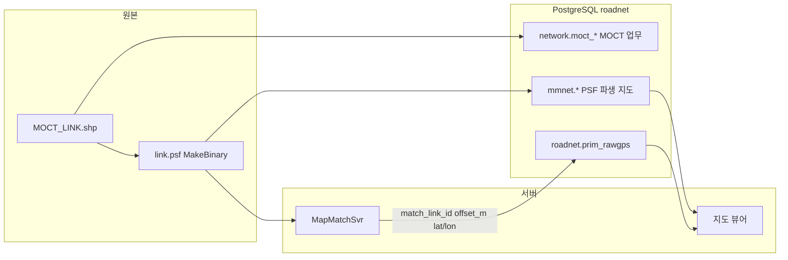

# PSF 기반 맵매칭 지도 표시 DB 설계안

맵매칭 결과를 **link.psf와 동일한 형상·좌표계**로 지도에 표시하기 위한 PostgreSQL/PostGIS 스키마 설계입니다.

기존 `network.moct_*`(MOCT Shapefile 직접 적재, EPSG:5186)와 **분리**하고, **PSF 파생 도로망** + **선형 참조(링크+offset)** 를 사용합니다.

---

## 1. 설계 목표

| 목표 | 설명 |
|------|------|
| **오차 제거** | 지도 도로선·매칭점이 MapMatchSvr(`link.psf`, WGS84)와 동일 기하 사용 |
| **위치 권위** | `match_link_id` + `match_offset_m`(f_node 방향 링크 위 거리)를 1차 위치 정보로 사용 |
| **호환** | `match_lat`/`match_lon`은 빠른 표시·레거시용으로 유지 |
| **버전 관리** | `link.psf` 재생성 시 `dataset_id`로 세대 구분 |
| **역할 분리** | 업무용 MOCT 전체(`network`) vs 맵매칭·지도용(`mmnet`) |

### 좌표계

| 영역 | SRID | 비고 |
|------|------|------|
| `mmnet.*` 형상 | **EPSG:4326** (WGS84) | PSF 내부 좌표(도×360000)와 동일 계열 |
| `network.moct_*` | EPSG:5186 | 기존 표준노드링크 업무·과금 등 (유지) |
| `roadnet.prim_rawgps` GPS/MATCH | WGS84 경위도 | 기존과 동일 |

---

## 2. 아키텍처



### ER 관계

```
mmnet.dataset (dataset_id)
    │
    ├──< mmnet.link (dataset_id, link_id)
    │         │
    │         └──< mmnet.link_segment (dataset_id, link_id, seg_seq)
    │
    └──< mmnet.link_turn (dataset_id, in_link_id, out_link_id)

roadnet.prim_rawgps
    ├── mm_dataset_id  → mmnet.dataset.dataset_id
    └── match_link_id  → mmnet.link.link_id (동일 dataset_id)
```

---

## 3. 스키마

```sql
CREATE SCHEMA IF NOT EXISTS mmnet;
COMMENT ON SCHEMA mmnet IS 'PSF(link.psf) 파생 도로망 — 맵매칭·지도 표시 전용 (WGS84)';
```

| 스키마 | 용도 |
|--------|------|
| `network` | MOCT 표준노드링크 전체 (기존 유지) |
| `mmnet` | PSF와 1:1 맞춘 지도·매칭 표시용 |
| `roadnet` | GPS 로그·매칭 결과 (`prim_rawgps`) |

---

## 4. 테이블: `mmnet.dataset`

**설명:** `link.psf` 빌드 세대(버전). 맵매칭·지도가 **동일 dataset** 을 참조해야 오차가 없습니다.

| 컬럼명 | PostgreSQL 타입 | NULL | PK/FK | 설명 |
|--------|-----------------|------|-------|------|
| `dataset_id` | `serial` | NOT NULL | **PK** | PSF 적재 세대 ID |
| `psf_path` | `varchar(512)` | NOT NULL | | 원본 파일 경로 (예: `MapMatchSvr/bin/link.psf`) |
| `psf_sha256` | `char(64)` | YES | | 파일 해시 (변경 감지) |
| `psf_build_dt` | `char(14)` | YES | | PSF 생성 시각 (KST `YYYYMMDDHH24MISS`) |
| `coord_source` | `smallint` | NOT NULL | | CreateData `coordtype` (9=EPSG:5186 입력) |
| `link_count` | `integer` | NOT NULL | | LINK_INFO 건수 |
| `segment_count` | `integer` | NOT NULL | | 세그먼트 건수 |
| `turn_count` | `integer` | NOT NULL | | 허용 턴 건수 |
| `is_active` | `boolean` | NOT NULL | | MapMatchSvr·뷰어 기본 사용 세대 (`true` 1건만) |
| `created_at` | `timestamptz` | NOT NULL | | DB 적재 시각 |
| `remark` | `varchar(200)` | YES | | 비고 |

### DDL

```sql
CREATE TABLE mmnet.dataset (
    dataset_id    serial       PRIMARY KEY,
    psf_path      varchar(512) NOT NULL,
    psf_sha256    char(64),
    psf_build_dt  char(14),
    coord_source  smallint     NOT NULL DEFAULT 9,
    link_count    integer      NOT NULL DEFAULT 0,
    segment_count integer      NOT NULL DEFAULT 0,
    turn_count    integer      NOT NULL DEFAULT 0,
    is_active     boolean      NOT NULL DEFAULT false,
    created_at    timestamptz  NOT NULL DEFAULT now(),
    remark        varchar(200)
);

COMMENT ON TABLE  mmnet.dataset IS 'link.psf 적재 세대(버전) — 맵매칭·지도 표시 기준';
COMMENT ON COLUMN mmnet.dataset.is_active IS 'true 인 세대 1건만 — MapMatchSvr·뷰어 기본 참조';
```

### INDEX

```sql
-- 활성 세대 빠른 조회 (부분 유니크)
CREATE UNIQUE INDEX uq_mmnet_dataset_active
    ON mmnet.dataset (is_active)
    WHERE is_active = true;

CREATE INDEX idx_mmnet_dataset_sha256 ON mmnet.dataset (psf_sha256);
```

---

## 5. 테이블: `mmnet.link`

**설명:** PSF `LINK_INFO` + 링크 전체 LineString(세그먼트 순서 결합). **지도 도로선 표시·offset 보간**의 기준 테이블.

| 컬럼명 | PostgreSQL 타입 | NULL | PK/FK | PSF 대응 | 설명 |
|--------|-----------------|------|-------|----------|------|
| `dataset_id` | `integer` | NOT NULL | **PK**, **FK** | — | → `mmnet.dataset` |
| `link_id` | `varchar(10)` | NOT NULL | **PK** | `qwLinkID` | 링크 ID (10자리) |
| `f_node_id` | `varchar(10)` | YES | | `qwStNodeID` | 시작 노드 |
| `t_node_id` | `varchar(10)` | YES | | `qwEdNodeID` | 종료 노드 |
| `length_m` | `numeric(12,3)` | NOT NULL | | `dfLen` | 링크 길이(m), offset 분모 |
| `max_spd` | `smallint` | YES | | `nMaxSpeed` | 제한속도 |
| `road_rank` | `smallint` | YES | | `nRoadRank` | 도로 등급 |
| `road_type` | `smallint` | YES | | `nRoadType` | 0 일반, 1 교량, 2 터널, 3 고가, 4 지하 |
| `lanes` | `smallint` | YES | | `nLanes` | 차로 수 |
| `connect` | `smallint` | YES | | `nConnect` | 연결로 (0/1, 구코드 101~108) |
| `road_name` | `varchar(46)` | YES | | `szRoadName` | 도로명 |
| `sgmt_count` | `smallint` | NOT NULL | | `wSgmtCount` | 세그먼트 개수 |
| `st_node_type` | `smallint` | YES | | `nStNodeType` | 시작 노드 유형 |
| `ed_node_type` | `smallint` | YES | | `nEdNodeType` | 종료 노드 유형 |
| `geom` | `geometry(LineString,4326)` | NOT NULL | GIST | 세그먼트 결합 | **지도 표시용** WGS84 Polyline |

### DDL

```sql
CREATE TABLE mmnet.link (
    dataset_id    integer      NOT NULL REFERENCES mmnet.dataset(dataset_id) ON DELETE CASCADE,
    link_id       varchar(10)  NOT NULL,
    f_node_id     varchar(10),
    t_node_id     varchar(10),
    length_m      numeric(12,3) NOT NULL,
    max_spd       smallint,
    road_rank     smallint,
    road_type     smallint,
    lanes         smallint,
    connect       smallint,
    road_name     varchar(46),
    sgmt_count    smallint     NOT NULL DEFAULT 0,
    st_node_type  smallint,
    ed_node_type  smallint,
    geom          geometry(LineString, 4326) NOT NULL,
    CONSTRAINT pk_mmnet_link PRIMARY KEY (dataset_id, link_id),
    CONSTRAINT ck_mmnet_link_length CHECK (length_m > 0)
);

COMMENT ON TABLE  mmnet.link IS 'PSF 링크 메타 + WGS84 LineString (세그먼트 결합)';
COMMENT ON COLUMN mmnet.link.length_m IS 'f_node→t_node 방향 링크 길이(m). match_offset_m 분모';
COMMENT ON COLUMN mmnet.link.geom IS 'link_segment 순서 결합 — MapMatchSvr과 동일 경로';
```

### INDEX

```sql
CREATE INDEX idx_mmnet_link_geom ON mmnet.link USING GIST (geom);
CREATE INDEX idx_mmnet_link_f_node ON mmnet.link (dataset_id, f_node_id);
CREATE INDEX idx_mmnet_link_t_node ON mmnet.link (dataset_id, t_node_id);
CREATE INDEX idx_mmnet_link_road_type ON mmnet.link (dataset_id, road_type);
```

---

## 6. 테이블: `mmnet.link_segment`

**설명:** PSF `LINK_SGMT_INFO` / `GRID_SGMT_INFO`와 동일한 **직선 세그먼트**.  
맵매칭 교차점은 항상 이 선분 위에 놓이므로, **세밀 검증·하이라이트**에 사용합니다.

| 컬럼명 | PostgreSQL 타입 | NULL | PK/FK | PSF 대응 | 설명 |
|--------|-----------------|------|-------|----------|------|
| `dataset_id` | `integer` | NOT NULL | **PK**, **FK** | — | |
| `link_id` | `varchar(10)` | NOT NULL | **PK**, **FK** | `qwLinkID` | |
| `seg_seq` | `smallint` | NOT NULL | **PK** | 링크 내 순번 | 0..`sgmt_count-1`, `len_from_link` 오름차순 |
| `sgmt_offset` | `integer` | NOT NULL | UNIQUE* | `dwSgmtOffset` | PSF 전역 세그먼트 오프셋 (추적용) |
| `len_from_link_m` | `numeric(10,2)` | NOT NULL | | `wLenFromLink` | 링크 시작점→세그먼트 시작(m) |
| `len_m` | `numeric(10,2)` | NOT NULL | | `wLenSgmt` | 세그먼트 길이(m) |
| `dir_ang` | `smallint` | NOT NULL | | `wDirAng` | 진행 방위각(°) |
| `start_lon` | `numeric(10,6)` | NOT NULL | | `dwX/360000` | 세그먼트 시작 경도 |
| `start_lat` | `numeric(10,6)` | NOT NULL | | `dwY/360000` | 세그먼트 시작 위도 |
| `end_lon` | `numeric(10,6)` | NOT NULL | | 계산 | 세그먼트 끝 경도 |
| `end_lat` | `numeric(10,6)` | NOT NULL | | 계산 | 세그먼트 끝 위도 |
| `geom` | `geometry(LineString,4326)` | NOT NULL | GIST | 2점 직선 | 세그먼트 형상 |

\* `(dataset_id, sgmt_offset)` UNIQUE 권장

### offset ↔ 세그먼트 매핑

```
match_offset_m ∈ [len_from_link_m, len_from_link_m + len_m]
  → 해당 seg_seq 세그먼트 위 매칭점
```

서버 산출식: `match_offset_m = wLenFromLink + dfSgmtMatchLen`

### DDL

```sql
CREATE TABLE mmnet.link_segment (
    dataset_id       integer        NOT NULL,
    link_id          varchar(10)    NOT NULL,
    seg_seq          smallint       NOT NULL,
    sgmt_offset      integer        NOT NULL,
    len_from_link_m  numeric(10,2)  NOT NULL DEFAULT 0,
    len_m            numeric(10,2)  NOT NULL,
    dir_ang          smallint       NOT NULL,
    start_lon        numeric(10,6)  NOT NULL,
    start_lat        numeric(10,6)  NOT NULL,
    end_lon          numeric(10,6)  NOT NULL,
    end_lat          numeric(10,6)  NOT NULL,
    geom             geometry(LineString, 4326) NOT NULL,
    CONSTRAINT pk_mmnet_link_segment PRIMARY KEY (dataset_id, link_id, seg_seq),
    CONSTRAINT fk_mmnet_link_segment_link
        FOREIGN KEY (dataset_id, link_id)
        REFERENCES mmnet.link (dataset_id, link_id) ON DELETE CASCADE,
    CONSTRAINT uq_mmnet_link_segment_offset UNIQUE (dataset_id, sgmt_offset),
    CONSTRAINT ck_mmnet_link_segment_len CHECK (len_m > 0)
);

COMMENT ON TABLE  mmnet.link_segment IS 'PSF 직선 세그먼트 — 맵매칭 교차점이 놓이는 최소 단위';
COMMENT ON COLUMN mmnet.link_segment.len_from_link_m IS '링크 f_node 방향 누적거리(m) — match_offset_m 기준';
```

### INDEX

```sql
CREATE INDEX idx_mmnet_link_segment_geom ON mmnet.link_segment USING GIST (geom);
CREATE INDEX idx_mmnet_link_segment_link ON mmnet.link_segment (dataset_id, link_id);
CREATE INDEX idx_mmnet_link_segment_offset_range
    ON mmnet.link_segment (dataset_id, link_id, len_from_link_m);
```

---

## 7. 테이블: `mmnet.link_turn` (선택)

**설명:** PSF 디스크 `TURN_INFO_DISK`(진입→진출, 회전각). 지도에서 **연속 맵매칭 경로·분기 디버깅**용. 필수는 아님.

| 컬럼명 | PostgreSQL 타입 | NULL | PK/FK | PSF 대응 | 설명 |
|--------|-----------------|------|-------|----------|------|
| `dataset_id` | `integer` | NOT NULL | **PK**, **FK** | | |
| `in_link_id` | `varchar(10)` | NOT NULL | **PK** | `qwInLinkID` | 진입 링크 |
| `out_link_id` | `varchar(10)` | NOT NULL | **PK** | `qwOutLinkID` | 진출 링크 |
| `turn_ang` | `smallint` | NOT NULL | | `nTurnAng` | 회전각(°) |
| `turn_offset` | `integer` | YES | | `dwTurnOffset` | PSF 턴 오프셋 |

```sql
CREATE TABLE mmnet.link_turn (
    dataset_id   integer     NOT NULL REFERENCES mmnet.dataset(dataset_id) ON DELETE CASCADE,
    in_link_id   varchar(10) NOT NULL,
    out_link_id  varchar(10) NOT NULL,
    turn_ang     smallint    NOT NULL,
    turn_offset  integer,
    CONSTRAINT pk_mmnet_link_turn PRIMARY KEY (dataset_id, in_link_id, out_link_id)
);

CREATE INDEX idx_mmnet_link_turn_in ON mmnet.link_turn (dataset_id, in_link_id);
CREATE INDEX idx_mmnet_link_turn_out ON mmnet.link_turn (dataset_id, out_link_id);
```

---

## 8. `roadnet.prim_rawgps` 확장 (매칭 결과)

기존 PK·인덱스 유지. **맵매칭 성공/ SKIP(참고좌표)** 시 저장.

| 추가 컬럼 | PostgreSQL 타입 | NULL | FK | 설명 |
|-----------|-----------------|------|-----|------|
| `mm_dataset_id` | `integer` | YES | → `mmnet.dataset` | 매칭 시 사용한 PSF 세대 |
| `match_link_id` | `varchar(10)` | YES | (dataset_id, link_id) 논리 FK | 매칭 링크 ID |
| `match_offset_m` | `numeric(10,2)` | YES | | f_node 방향 링크 위 거리(m) = `wLenFromLink + dfSgmtMatchLen` |
| `match_seg_seq` | `smallint` | YES | | (선택) 세그먼트 순번 — 적재 시 함께 저장하면 조회 단순화 |

### ALTER 예시

```sql
ALTER TABLE roadnet.prim_rawgps
    ADD COLUMN IF NOT EXISTS mm_dataset_id  integer,
    ADD COLUMN IF NOT EXISTS match_link_id  varchar(10),
    ADD COLUMN IF NOT EXISTS match_offset_m numeric(10,2),
    ADD COLUMN IF NOT EXISTS match_seg_seq  smallint;

COMMENT ON COLUMN roadnet.prim_rawgps.mm_dataset_id   IS '매칭 PSF 세대 → mmnet.dataset.dataset_id';
COMMENT ON COLUMN roadnet.prim_rawgps.match_link_id   IS '매칭 링크 ID (PSF qwLinkID)';
COMMENT ON COLUMN roadnet.prim_rawgps.match_offset_m    IS 'f_node 방향 링크 위 거리(m) — 지도 표시 권위 좌표';
COMMENT ON COLUMN roadnet.prim_rawgps.match_seg_seq     IS '매칭 세그먼트 순번 (선택, mmnet.link_segment.seg_seq)';
```

### INDEX

```sql
CREATE INDEX idx_prim_rawgps_mm_link
    ON roadnet.prim_rawgps (mm_dataset_id, match_link_id)
    WHERE match_link_id IS NOT NULL;

CREATE INDEX idx_prim_rawgps_trip_match
    ON roadnet.prim_rawgps (trip_id, match_status)
    WHERE match_status IN (1, 3);
```

### 저장 규칙 (MapMatchSvr)

| match_status | mm_dataset_id | match_link_id | match_offset_m | match_lat/lon |
|--------------|---------------|---------------|----------------|---------------|
| 1 MATCHED | active dataset | `qwLinkID` | `wLenFromLink + dfSgmtMatchLen` | 저장 (호환) |
| 3 SKIP | active dataset | 참고 시 동일 | 참고 시 동일 | 저장 |
| 4 ERROR | NULL | NULL | NULL | NULL |

---

## 9. 지도 표시 조회

### 9.1 trip 주변 도로 (PSF LineString)

```sql
WITH active AS (
    SELECT dataset_id FROM mmnet.dataset WHERE is_active = true LIMIT 1
),
pts AS (
    SELECT ST_SetSRID(ST_MakePoint(gps_lon::float8, gps_lat::float8), 4326) AS g
    FROM roadnet.prim_rawgps
    WHERE trip_id = :trip_id AND gps_lat IS NOT NULL
),
env AS (
    SELECT ST_Buffer(ST_Collect(g)::geography, :buffer_m)::geometry AS geom
    FROM pts
)
SELECT l.link_id, l.road_name, l.road_type, ST_AsGeoJSON(l.geom) AS geojson
FROM mmnet.link l
CROSS JOIN active a
CROSS JOIN env e
WHERE l.dataset_id = a.dataset_id
  AND l.geom && e.geom
  AND ST_Intersects(l.geom, e.geom);
```

### 9.2 매칭점 — offset 기반 (권장, PSF 오차 없음)

```sql
SELECT
    p.gps_seq,
    p.match_status,
    p.match_link_id,
    p.match_offset_m,
    ST_AsGeoJSON(
        ST_LineInterpolatePoint(
            l.geom::geography,
            LEAST(GREATEST(p.match_offset_m / l.length_m, 0), 1)
        )::geometry
    ) AS match_point_geojson
FROM roadnet.prim_rawgps p
JOIN mmnet.dataset d ON d.dataset_id = p.mm_dataset_id AND d.is_active
JOIN mmnet.link l
  ON l.dataset_id = p.mm_dataset_id AND l.link_id = p.match_link_id
WHERE p.trip_id = :trip_id
  AND p.match_link_id IS NOT NULL;
```

### 9.3 매칭 링크 하이라이트 + 세그먼트

```sql
SELECT l.link_id, l.geom AS link_geom, s.seg_seq, s.geom AS seg_geom
FROM roadnet.prim_rawgps p
JOIN mmnet.link l
  ON l.dataset_id = p.mm_dataset_id AND l.link_id = p.match_link_id
JOIN mmnet.link_segment s
  ON s.dataset_id = p.mm_dataset_id AND s.link_id = p.match_link_id
 AND p.match_offset_m >= s.len_from_link_m
 AND p.match_offset_m <= s.len_from_link_m + s.len_m
WHERE p.trip_id = :trip_id AND p.gps_seq = :gps_seq;
```

### 9.4 뷰 (API 단순화)

```sql
CREATE OR REPLACE VIEW mmnet.v_match_display AS
SELECT
    p.trip_id,
    p.gps_seq,
    p.match_status,
    p.mm_dataset_id,
    p.match_link_id,
    p.match_offset_m,
    p.match_lat,
    p.match_lon,
    p.intersect_len,
    l.road_name,
    l.road_type,
    l.length_m AS link_length_m,
    ST_LineInterpolatePoint(
        l.geom::geography,
        LEAST(GREATEST(p.match_offset_m / NULLIF(l.length_m, 0), 0), 1)
    )::geometry(Point, 4326) AS match_geom_psf,
    ST_SetSRID(ST_MakePoint(p.match_lon::float8, p.match_lat::float8), 4326) AS match_geom_stored
FROM roadnet.prim_rawgps p
JOIN mmnet.link l
  ON l.dataset_id = p.mm_dataset_id AND l.link_id = p.match_link_id
WHERE p.match_link_id IS NOT NULL;
```

`match_geom_psf`와 `match_geom_stored` 거리로 PSF↔저장 좌표 검증 가능.

---

## 10. PSF → mmnet 적재 (ETL)

### 10.1 파이프라인

```
MakeBinary (link.psf)
    → psf_export_mmnet (신규 스크립트/바이너리)
        → mmnet.dataset (1행, is_active 토글)
        → mmnet.link_segment (전량)
        → mmnet.link (세그먼트 결합 geom + length_m)
        → mmnet.link_turn (선택)
```

### 10.2 적재 규칙

1. `link.psf` 읽기 — MapMatchSvr `DataLoader`와 **동일 레이아웃**
2. 좌표: `uint32 / 360000.0` → WGS84 `numeric(10,6)`
3. `mmnet.link.geom` = `seg_seq` 순 `ST_MakeLine(세그먼트 끝점 연결)`
4. `length_m` = PSF `dfLen` (반올림 일치)
5. 새 `dataset_id` 적재 후 `is_active` 스위칭 (트랜잭션)
6. MapMatchSvr `config.ini` / 뷰어 config에 **동일 active dataset_id** 기록

### 10.3 moct_node 필요 여부

| 용도 | 필요 |
|------|------|
| 도로선 + offset 매칭점 표시 | **불필요** (`mmnet.link`, `link_segment`) |
| 교차로·노드 유형 디버깅 | `network.moct_node` 또는 PSF 노드 좌표(`f_node_id`/`t_node_id`) |

---

## 11. 기존 `network.moct_*` 와의 관계

| 항목 | `network.moct_link` | `mmnet.link` |
|------|---------------------|--------------|
| 원본 | Shapefile 직접 | **link.psf 파생** |
| 좌표계 | EPSG:5186 | EPSG:4326 |
| 용도 | MOCT 업무·과금·전체 속성 | **맵매칭 지도 표시** |
| multilink 등 | 있음 | 없음 (맵매칭 미사용) |
| 링크 수 | 1,555,150 | PSF와 동일 |

**지도 뷰어는 `mmnet`만 사용**하고, MOCT 업무 화면은 `network` 유지를 권장합니다.

---

## 12. 마이그레이션 순서 (권장)

1. `mmnet` 스키마·테이블·인덱스 생성
2. `psf_export_mmnet`로 최신 `link.psf` 적재, `is_active=true`
3. `prim_rawgps` 컬럼 추가 + `rawgps_update` SQL·MapMatchSvr 저장 로직 확장
4. 웹 뷰어 API: `/roads` → `mmnet.link`, M 표시 → offset 우선
5. (선택) 기존 trip 재맵매칭 또는 `match_link_id`/`offset` NULL 구간만 신규 적용

---

## 13. 요약

| 질문 | 답 |
|------|-----|
| PSF 오차 없이 지도 표시? | **`mmnet.*`(PSF 파생, WGS84)** + **`match_link_id` + `match_offset_m`** |
| 노드 테이블 별도? | **기본 표시 불필요**; 디버깅 시 `network.moct_node` 선택 |
| MOCT 전체 대체? | **아님** — `network` 유지, `mmnet`는 맵매칭·지도 전용 |
| PK 핵심 | `(dataset_id, link_id)`, `(dataset_id, link_id, seg_seq)`, `prim_rawgps(trip_id, gps_seq)` |

---

## 부록 A. 생성 SQL 파일 배치 (구현 시)

| 파일 | 내용 |
|------|------|
| `roadnet/sql/mmnet_create.sql` | 스키마·테이블·인덱스·뷰 |
| `roadnet/sql/prim_rawgps_match_cols.sql` | `prim_rawgps` 컬럼 추가 |
| `roadnet/scripts/psf_export_mmnet.py` | link.psf → mmnet 적재 |

## 부록 B. MapMatchSvr 저장 필드 매핑

| 서버 (`MATCH_LINK_INFO`) | DB (`prim_rawgps`) |
|--------------------------|-------------------|
| `qwLinkID` | `match_link_id` |
| `wLenFromLink + dfSgmtMatchLen` | `match_offset_m` |
| active `dataset_id` | `mm_dataset_id` |
| `dfMatchY`, `dfMatchX` | `match_lat`, `match_lon` |

---

*문서 버전: 2026-07-11 · 프로젝트: RUC MapMatchSvr / roadnet*
